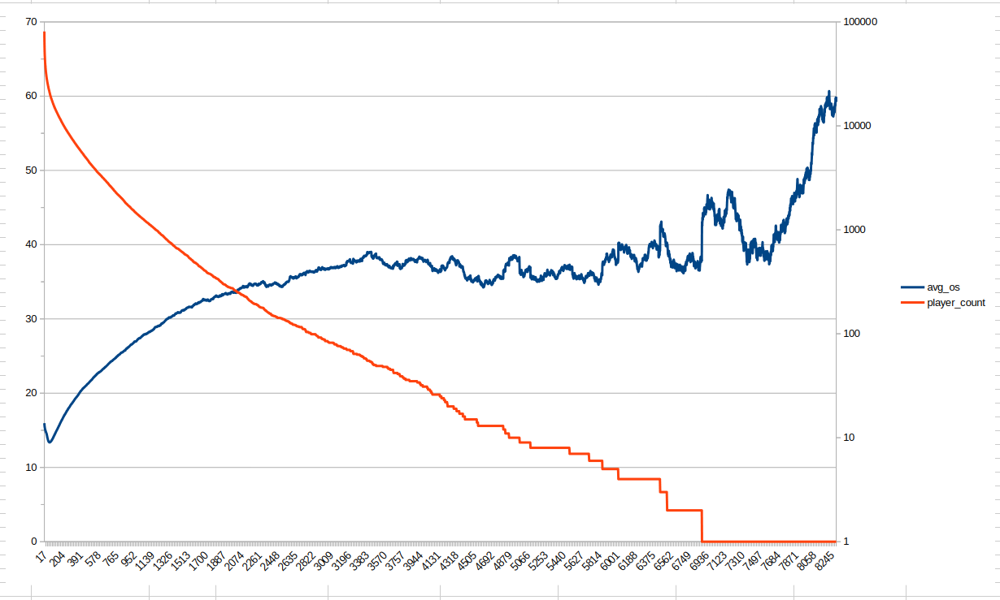

bargraph
========

Synthetizes bar raw data:
* https://data-marts.beyondallreason.dev/match_players.csv.gz
* https://data-marts.beyondallreason.dev/matches.csv.gz

Into a large .cvs file that can easily be used to
* calculate the average OS for all players on their Nth game, and the number of players who have played N games.
* plot a graph that shows the progression of OS by number of games and the number of players which OS has been averaged out

And by also reading players.cvs from the same source, one can add their personal progress curve for comparison.

All of which i hope to automatize.

Here's the graph as of 2026-06

